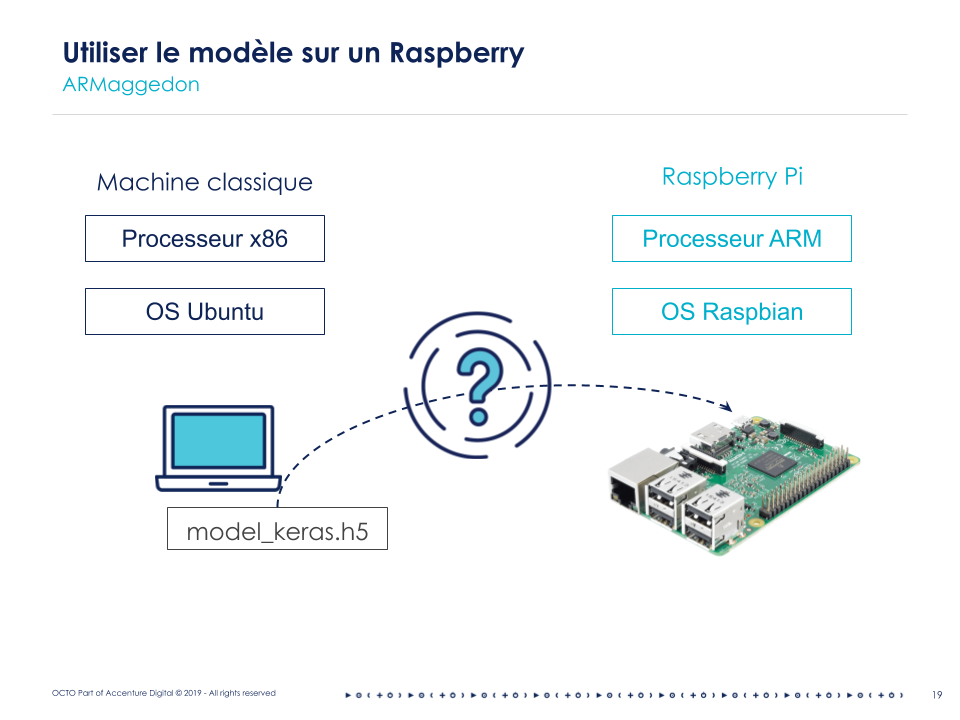
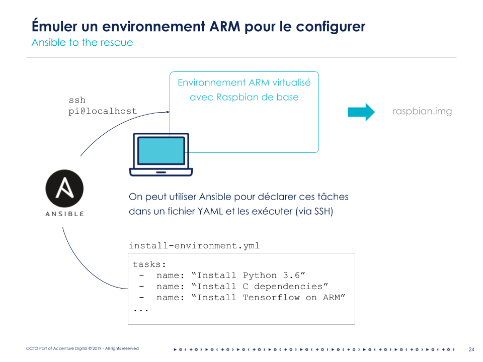
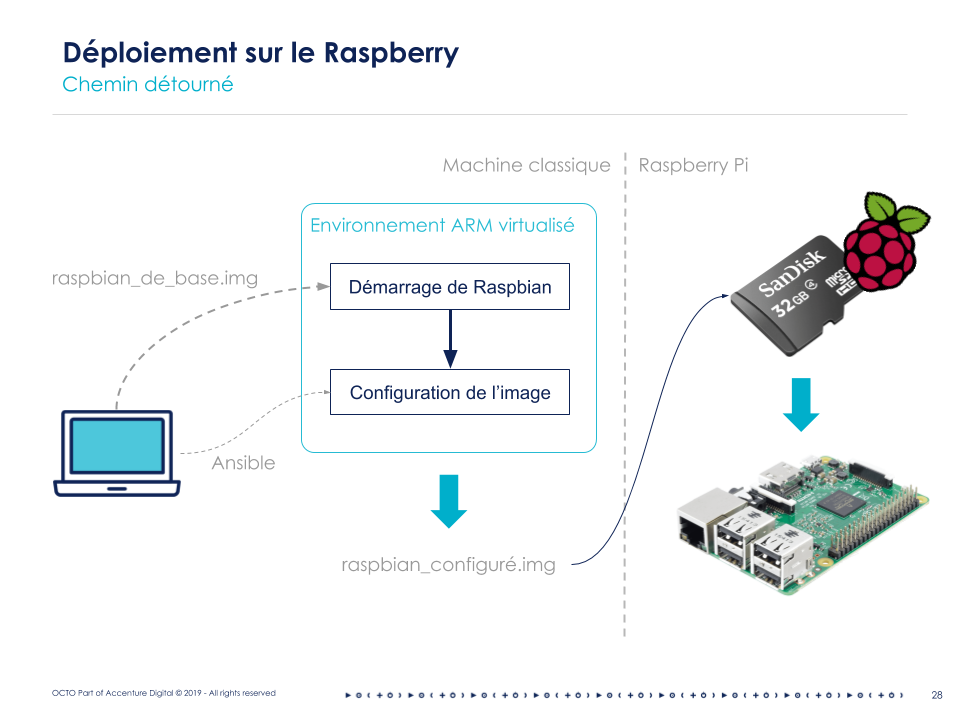

[](https://travis-ci.com/Saxamos/car-detector)

# car-detector

This is a drawing detection application for raspberry-pi. It detects if a drawing is a car or not. There are two modes of
running:
- take a picture of your drawing
- draw directly on the tactile screen of the raspberry


### Install the app

Install the app in your virtual env. At the root of the project, run:
```
pip install -e .
```

### Run the tests
```
TODO
```

### Launch the app

Run the folllowing command to load the app with camera:
```
car_detector camera
```

With clicking mouse drawing and optionnal arguments:
```
car_detector draw --model <path/to/model> --saved <path/to/save/image>
```

### Train a model

The modelisation notebook can be found at the root of the project. The data comes from the google quick draw application.
Usefull command for port forwarding (if you use ec2 instance):
```bash
ssh -L <local:port>:localhost:<distant:port> <user>@<ip-adress>
# example to forward tensorboard:
# todo: plot tensorboard train and eval curve on same plot to compare more easily
ssh -L 8881:localhost:6006 ubuntu@34.240.13.93

```

### Related article

[Article 1: train your model](https://blog.octo.com/ia-embarquee-deployer-du-deep-learning-sur-un-raspberry/)

[Article 2: deploy it on a raspberry](https://blog.octo.com/lia-embarquee-entrainer-deployer-et-utiliser-du-deep-learning-sur-un-raspberry-partie-2/)

[Article 3: use the model and enhance it](https://blog.octo.com/lia-embarquee-entrainer-deployer-et-utiliser-du-deep-learning-sur-un-raspberry-partie-3/)

### Schemes

#### Hardware issues on ARM



#### Use Ansible to configure Raspbian on QEMU



#### Pipeline overview


